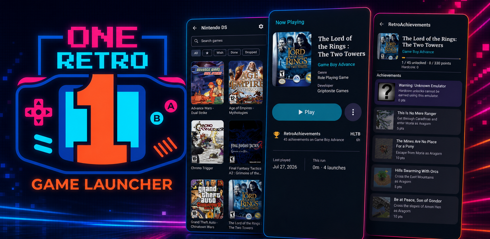

# One Retro Game Launcher



**Stop scrolling your ROM library. Pick one game, commit, and finish it.**

You know the ritual. Open the launcher, scroll past hundreds of games, dabble for
ten minutes, close the app. One Retro Game Launcher (ORGL) is built to break that
habit — a retro frontend designed around **commitment**, not endless browsing.

## Get the app

<p align="center">
  <a href="https://play.google.com/store/apps/details?id=com.sayemshafayet.onereogamelauncher">Google Play</a>
  &nbsp;|&nbsp;
  <a href="https://github.com/iShafayet/OneRetroGameLauncher/releases">Github Releases</a>
  &nbsp;|&nbsp;
  <a href="https://apps.obtainium.imranr.dev/redirect.html?r=obtainium://app/%7B%22id%22%3A%22com.sayemshafayet.orglfoss%22%2C%22url%22%3A%22https%3A%2F%2Fgithub.com%2FiShafayet%2FOneRetroGameLauncher%22%2C%22author%22%3A%22iShafayet%22%2C%22name%22%3A%22One%20Retro%20Game%20Launcher%22%2C%22preferredApkIndex%22%3A0%2C%22overrideSource%22%3A%22GitHub%22%2C%22additionalSettings%22%3A%22%7B%5C%22includePrereleases%5C%22%3Atrue%2C%5C%22apkFilterRegEx%5C%22%3A%5C%22orgl-foss-release%5C%22%2C%5C%22invertAPKFilter%5C%22%3Afalse%2C%5C%22about%5C%22%3A%5C%22Stop%20scrolling%20your%20library.%20Start%20finishing%20it.%20FOSS%20package%20com.sayemshafayet.orglfoss.%5C%22%7D%22%7D">Obtainium</a>
</p>

## Why ORGL

1. **Pick one game.** Tonight’s Trio offers curated picks from your wishlist and
   suggestions. Shuffle until something clicks.
2. **Lock in.** Play mode holds that game until you finish it or consciously drop
   it. No shame in dropping — every run teaches you something.
3. **Play, then journal.** Rate it, write a short review, save a shareable run
   card. Over time you build a history of games you actually played, not just
   collected.

Want a little flexibility? Enable up to five independent Now Playing slots —
handy for pairing a long RPG with something short for the commute.

## Your library, your rules

ORGL is **not an emulator** and never rewrites your ROMs. Files stay read-only in
the familiar one-folder-per-system layout. Launch through RetroArch or standalone
emulators (DuckStation, Dolphin, PPSSPP, melonDS, and more), with defaults per
system and overrides per game.

Already on ES-DE? Link that folder and reuse scraped artwork and metadata
read-only — no migration, no re-scraping. Browse box art, screenshots, videos,
and fan art in a clean gallery.

## Built for the couch

Full gamepad support with D-pad navigation, shoulder-button tab switching, and a
keyboard that stays out of the way of your controller — handheld, phone, or TV
box.

## More good stuff

- Wishlist as a real play queue, separate from favorites
- Optional RetroAchievements progress (unlocks still happen in RetroArch)
- Optional HowLongToBeat estimates so you know what you’re signing up for
- Search, favorites, recently played, status filters, and personal notes
- Portable app data in one folder you control
- Light and dark themes

## Get the app

| Channel | What you get |
|---------|----------------|
| **[GitHub Releases](https://github.com/iShafayet/OneRetroGameLauncher/releases)** | FOSS APK — **beta and stable** (`com.sayemshafayet.orglfoss`) |
| **[Obtainium](https://apps.obtainium.imranr.dev/redirect.html?r=obtainium://app/%7B%22id%22%3A%22com.sayemshafayet.orglfoss%22%2C%22url%22%3A%22https%3A%2F%2Fgithub.com%2FiShafayet%2FOneRetroGameLauncher%22%2C%22author%22%3A%22iShafayet%22%2C%22name%22%3A%22One%20Retro%20Game%20Launcher%22%2C%22preferredApkIndex%22%3A0%2C%22overrideSource%22%3A%22GitHub%22%2C%22additionalSettings%22%3A%22%7B%5C%22includePrereleases%5C%22%3Atrue%2C%5C%22apkFilterRegEx%5C%22%3A%5C%22orgl-foss-release%5C%22%2C%5C%22invertAPKFilter%5C%22%3Afalse%2C%5C%22about%5C%22%3A%5C%22Stop%20scrolling%20your%20library.%20Start%20finishing%20it.%20FOSS%20package%20com.sayemshafayet.orglfoss.%5C%22%7D%22%7D)** | Auto-updates from those releases (config source: [`obtainium.json`](obtainium.json)) |
| **Google Play** | **Stable** builds only (`com.sayemshafayet.onereogamelauncher`) |

Website: [oneretrogamelauncher.com](https://oneretrogamelauncher.com)

## License

**One Retro Game Launcher is free and open source software under the
[GNU General Public License v3.0](LICENSE) (GPL-3.0).**

You can run, study, share, and modify it. If you distribute the app or a modified
version, you must keep it under GPL-3.0 and share the corresponding source.

The app itself includes **no telemetry**. Optional third-party services you turn
on (for example RetroAchievements or HowLongToBeat) have their own policies.

Full text: [`LICENSE`](LICENSE)

## Acknowledgements

### Created by Sayem Shafayet

FOSS engineer and maintainer. Builds free software that keeps data in your hands —
including [libre.money](https://libre.money) and [nkrypt.xyz](https://nkrypt.xyz) —
and ORGL continues that same open ethos.

- Website: [sayemshafayet.com](https://sayemshafayet.com)
- GitHub: [github.com/iShafayet](https://github.com/iShafayet)

Project site: [oneretrogamelauncher.com](https://oneretrogamelauncher.com) ·
Source: [github.com/iShafayet/OneRetroGameLauncher](https://github.com/iShafayet/OneRetroGameLauncher)

### Data sources

- ES-DE system definitions (`es_systems` / `es_find_rules`)
- ScreenScraper (optional account)
- libretro-thumbnails (fallback artwork)
- RetroAchievements (optional account)
- HowLongToBeat (optional)

### Artwork

System console icons by [KyleBing](https://github.com/KyleBing/retro-game-console-icons)
([GPL-3.0](https://github.com/KyleBing/retro-game-console-icons))

### Libraries

Jetpack Compose, Material 3, Room, DataStore, Hilt, OkHttp, Coil, Kotlin Coroutines

---

Your backlog is not a museum. **Stop scrolling. Start finishing.**

---

<details>
<summary>Build from source (developers)</summary>

Requires JDK 21 and the Android SDK.

```bash
export JAVA_HOME=/usr/lib/jvm/temurin-21-jdk
make doctor
make build          # FOSS debug APK
make test
make run            # install + launch on a connected device/emulator
```

</details>
